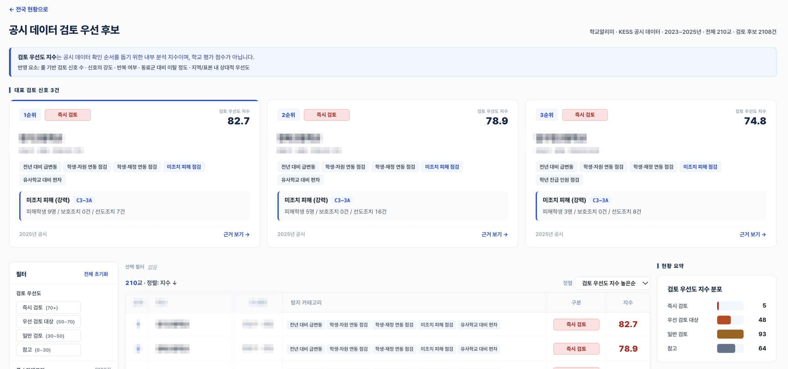
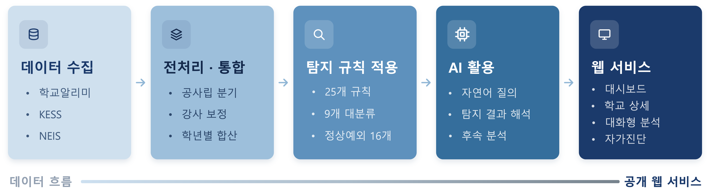
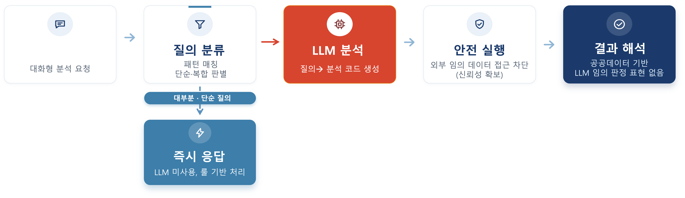
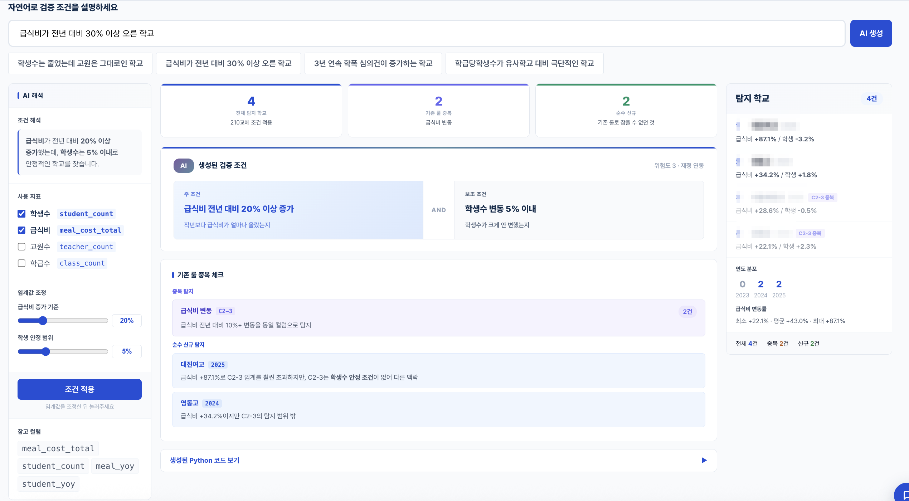
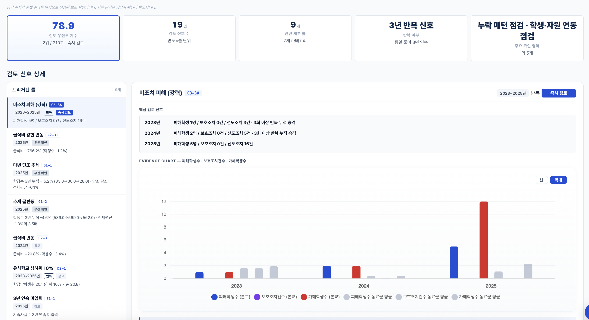
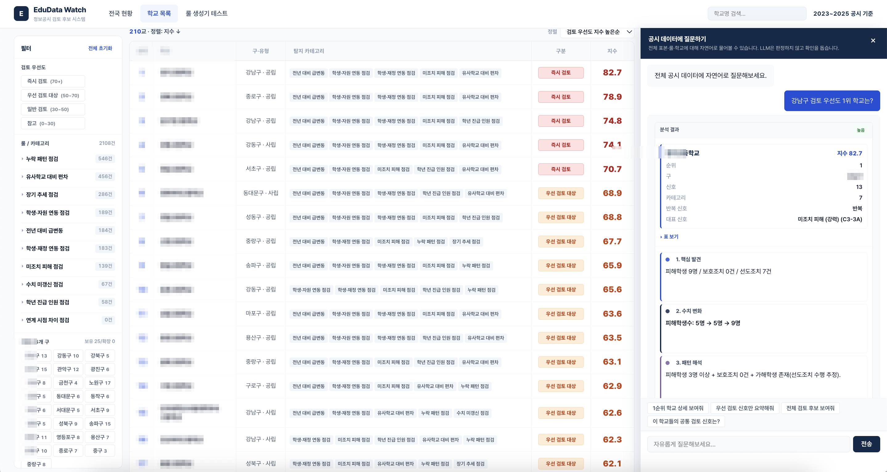

  
   
  이미지를 클릭하면 실제 서비스를 체험할 수 있습니다.

<h1 align="center">EduData Watch</h1>

  <b>교육 정보공시 자동 검증 · 이상치 탐지 시스템</b> 
  제8회 교육 공공데이터 AI 활용대회 출품작 (일반부문 — AI 활용 아이디어 기획)

  
  
  
  
  

  
  
  

---

## 프로젝트 소개

교육 정보공시 데이터는 매년 학교가 직접 입력하고, 교육청이 검증한 뒤 공시됩니다. 기존 검증 체계는 **입력 형식과 필수값 누락** 중심으로 설계되어 있어, 항목 간 맥락적 모순이나 시계열 급변동 같은 신호는 구조적으로 다루기 어렵습니다.

**EduData Watch**는 이러한 영역을 보완합니다. 25개 규칙 기반 탐지 엔진과 AI 보조 분석을 결합하여, 공시 담당자가 **우선적으로 확인해야 할 항목**을 자동으로 추출하고 순위를 매깁니다.

> 검증 체계를 대체하는 것이 아니라, 기존 체계가 놓칠 수 있는 **맥락적 일관성 영역**을 보완하는 도구입니다.

---

## 주요 기능

| 기능 | 설명 |
|------|------|
| **자동 탐지** | 9개 대분류 · 25개 규칙으로 불일치, 급변동, 미입력 패턴 등을 탐지합니다 |
| **우선도 지수** | 학교별 0~100 점수로 환산합니다 (V=신호 강도 · C=영역 수 · R=반복) |
| **심각도 분류** | 즉시 검토 · 우선 검토 · 일반 검토 · 참고 4단계로 분류합니다 |
| **AI 분석** | Gemini 자연어 대화로 맥락 설명과 추가 분석을 제공합니다 |
| **유사학교 비교** | 같은 자치구 내 학교 간 횡단 비교로 편차를 탐지합니다 |
| **추세 감지** | 3개년 데이터에서 단조 추세, 급변동, 동일값 반복을 식별합니다 |

---

## 시스템 구조

EduData Watch는 5단계 파이프라인으로 동작합니다.

  

| 단계 | 설명 |
|------|------|
| **1. 데이터 수집** | 학교알리미 · KESS · NEIS에서 210교 × 3개년 데이터를 수집합니다 |
| **2. 전처리 · 통합** | 공시원별 분기, 강사 보정, 학년별 합산 등 파생 컬럼을 생성합니다 |
| **3. 탐지 규칙 적용** | 25개 규칙 엔진이 항목 간 일관성 · 시계열 · 횡단 비교를 수행합니다 |
| **4. AI 활용** | 탐지 결과에 대한 자연어 설명 생성 및 대화형 분석을 지원합니다 |
| **5. 웹 서비스** | 대시보드 · 학교 상세 · 대화형 분석 인터페이스를 제공합니다 |

---

## AI 활용

사용자의 자연어 질의를 분류하고, 사전 가드(pre-LLM)로 80%를 규칙 기반 처리한 뒤, 복합 질의만 LLM에 전달하는 **하이브리드 라우팅** 구조입니다.

  

- **도메인 지식 내장**: 데이터 범위, 항목 간 관계, 정상 예외 정의를 프롬프트에 포함합니다
- **안전 실행 환경**: LLM이 생성한 pandas 코드를 화이트리스트 샌드박스에서 실행합니다 (30줄 제한 · 5초 타임아웃 · I/O 차단)
- **톤 관리**: "오류"·"이상치" 대신 "검토 후보"·"확인 필요" 표현을 사용합니다

---

## 스크린샷

> 이미지를 클릭하면 실제 서비스를 체험할 수 있습니다.

  

**룰 생성기 (RuleLab)** — 자연어로 검증 조건을 입력하면 AI가 탐지 규칙을 생성하고, 기존 규칙과의 중복 여부를 분석합니다.

  

**학교별 검토 신호 상세** — 개별 학교의 탐지 항목, 연도별 추이 차트, AI 보조 분석 결과를 한 화면에서 확인할 수 있습니다.

  

**대화형 분석** — 자연어로 질문하면 탐지 결과 요약, 수치 변화, 패턴 해석을 제공합니다.

---

## 룰셋 구조

9개 대분류, 25개 세부 규칙으로 구성됩니다.

| 대분류 | 영역 | 규칙 수 | 설명 |
|--------|------|---------|------|
| **A** | 학생·자원 연동 점검 | 6개 | 학생수 · 학급수 · 교원수 간 비율 불일치 및 방향 불일치 탐지 |
| **B** | 미조치 피해 점검 | 2개 | 학교폭력 피해 발생에도 보호조치가 이루어지지 않은 패턴 |
| **C** | 전년 대비 급변동 | 6개 | 학생 · 교원 · 회계 · 진학률 · 학폭의 전년 대비 급격한 변동 |
| **D** | 유사학교 대비 편차 | 2개 | 같은 자치구 내 학교 간 극단적 편차 (IQR · 백분위) |
| **E** | 학생·재정 연동 점검 | 2개 | 학생수 안정인데 급식비가 급변동하는 패턴 |
| **F** | 누락·미갱신 점검 | 3개 | 3년 연속 미입력 · 단독 미입력 · 동일값 반복 |
| **G** | 학년 진급 인원 점검 | 1개 | 진급 시 학생 이탈률 비대칭 탐지 |
| **H** | 연계 시점 차이 점검 | 1개 | 학교알리미 vs KESS 교원수 불일치 |
| **I** | 시계열 추세 점검 | 2개 | 다년 단조 추세 및 추세 급변동 |

<b>A. 학생·자원 연동 점검 (6개)</b> — 학생수 변화와 자원 배치(학급, 교원) 변화의 방향이 어긋나거나 비율이 크게 깨진 경우를 탐지합니다.

 

| 규칙 ID | 규칙명 | 설명 |
|---------|--------|------|
| A1 | 학생↔학급 역방향 변동 | 학생수와 학급수가 반대 방향 + 학급수 2학급 이상 변동 |
| A2 | 학생↔학급 완만 역방향 | 학생수와 학급수가 반대 방향 + 학급수 1학급 변동 |
| A3 | 학생↔교원 불균형 | 학생수 ±5% 이내인데 교원수(강사 제외) 10% 이상 또는 5명 이상 변동 |
| A4 | 학급↔교원 불균형 | 학급수 0~1학급 변동인데 교원수(강사 제외) 5명 이상 변동 |
| A6 | 교원1인당학생수 급변 | 전년 대비 교원1인당학생수 20% 이상 변화 |
| A7 | 학급당학생수 급변 | 전년 대비 학급당학생수 변화량 ±1.5명/학급 이상 |

<b>B. 미조치 피해 점검 (2개)</b> — 학교폭력 심의에서 피해학생이 존재하는데 보호조치 건수가 0인 경우를 탐지합니다.

 

| 규칙 ID | 규칙명 | 설명 |
|---------|--------|------|
| B1 | 미조치 피해 (강력) | 피해학생 3명 이상 + 보호조치 0건, 또는 3회 이상 반복 |
| B2 | 미조치 피해 (참고) | 피해학생 1~2명 + 보호조치 0건 |

<b>C. 전년 대비 급변동 (6개)</b> — 한 학교의 한 항목이 전년 대비 비정상적으로 큰 변동을 보이는 경우를 탐지합니다.

 

| 규칙 ID | 규칙명 | 설명 |
|---------|--------|------|
| C1 | 학생·학급·교원 급변동(이중) | 전년 대비 10% 이상 변동이면서 직전 변동의 3배 이상 |
| C2 | 학생·학급·교원 급변동(단년) | 전년 대비 10% 이상 변동 |
| C3 | 학교회계 변동 | 세입/세출 전년 대비 ±30% 이상 변동 |
| C4 | 학교회계 강한 변동 | 세입/세출 전년 대비 ±50% 이상 변동 |
| C5 | 진학률 급변동 | 전년 대비 ±15%p 이상 변동 |
| C6 | 학폭 심의 급증 | 전년 0~1건에서 당해 5건 이상으로 급증 |

<b>D. 유사학교 대비 편차 (2개)</b> — 같은 자치구 내 유사학교와 비교했을 때 한 학교만 두드러지게 다른 경우를 탐지합니다.

 

| 규칙 ID | 규칙명 | 설명 |
|---------|--------|------|
| D1 | 유사학교 상하위 10% | 학급당학생수 · 교원1인당학생수 · 급식비에서 상하위 10% 백분위 밖 |
| D2 | 유사학교 IQR 극단값 | IQR 1.5배 외부 또는 중앙값 대비 50% 이상 차이 |

<b>E. 학생·재정 연동 점검 (2개)</b> — 학생수가 안정적인데 재정 항목이 급변동하는 경우를 탐지합니다.

 

| 규칙 ID | 규칙명 | 설명 |
|---------|--------|------|
| E1 | 급식비 변동 | 학생수 ±5% 이내인데 급식비 ±10% 이상 변동 |
| E2 | 급식비 강한 변동 | 학생수 ±5% 이내인데 급식비 ±30% 이상 변동 |

<b>F. 누락·미갱신 점검 (3개)</b> — 특정 항목이 여러 연도에 걸쳐 누락되거나 동일한 값이 반복되는 경우를 탐지합니다.

 

| 규칙 ID | 규칙명 | 설명 |
|---------|--------|------|
| F1 | 3년 동일값 반복 | 3개년 동안 동일한 수치가 반복 입력 (노이즈 필터 적용) |
| F2 | 3년 연속 미입력 | 의무 시설 항목이 3년 연속 미입력 |
| F3 | 단독 미입력 | 유사학교 90% 이상 입력한 항목을 단독 미입력 |

<b>G. 학년 진급 인원 점검 (1개)</b> — 학년 진급 시 자연 감소 범위를 초과하는 인원 변화를 탐지합니다.

 

| 규칙 ID | 규칙명 | 설명 |
|---------|--------|------|
| G1 | 진급 시 학생 이탈 | 전년 1학년 → 당해 2학년 인원 변동이 -7%~+3% 범위 밖 |

<b>H. 연계 시점 차이 점검 (1개)</b> — 서로 다른 공시 출처 간 동일 항목의 값이 다른 경우를 탐지합니다.

 

| 규칙 ID | 규칙명 | 설명 |
|---------|--------|------|
| H1 | 교원수 교차 불일치 | 학교알리미(강사 제외)와 KESS 교원수 3명 이상 차이 |

<b>I. 시계열 추세 점검 (2개)</b> — 3개년 데이터에서 지속적인 추세나 추세의 급격한 변화를 탐지합니다.

 

| 규칙 ID | 규칙명 | 설명 |
|---------|--------|------|
| I1 | 다년 단조 추세 | 3년 연속 같은 방향 + 누적 변동 8% 이상 |
| I2 | 추세 급변동 | 같은 방향이지만 전체 평균의 2배 이상 속도로 변동 |

---

## 탐지 결과 요약

서울 210개 일반고 × 3개년(2023~2025) 데이터에서 **총 2,108건**의 검토 후보가 탐지되었습니다.

| 심각도 | 기준 | 학교 수 | 비율 |
|--------|------|---------|------|
| 즉시 검토 | 70점 이상 | **5교** | 2.4% |
| 우선 검토 대상 | 50~70점 | **48교** | 22.9% |
| 일반 검토 | 30~50점 | **93교** | 44.3% |
| 참고 | 30점 미만 | **64교** | 30.5% |

> 검토 우선도 지수는 공시 데이터 확인 순서를 돕기 위한 내부 분석 지수이며, 학교 평가 점수가 아닙니다.

---

## 기술 스택

| 레이어 | 기술 |
|--------|------|
| **Backend** | Python 3.9+ · FastAPI · Uvicorn |
| **Data** | pandas · NumPy · openpyxl |
| **AI** | Google Gemini 2.5 Flash-Lite · 하이브리드 라우팅 |
| **Frontend** | Vanilla JS · Chart.js · Pretendard |
| **Deploy** | Railway (NIXPACKS) |

---

## 활용 데이터

| 출처 | 설명 | 링크 |
|------|------|------|
| **학교알리미** | 학교현황, 교원현황, 급식비, 학교회계, 학교폭력 | [schoolinfo.go.kr](https://www.schoolinfo.go.kr/) |
| **KESS** | 학생수, 교원수, 학급수, 진학률 | [kess.kedi.re.kr](https://kess.kedi.re.kr/) |
| **NEIS** | 학교 기본정보 (설립유형, 학교유형) | [open.neis.go.kr](https://open.neis.go.kr/) |

- **대상**: 서울특별시 25개 자치구 일반고 210교
- **기간**: 2023 · 2024 · 2025 (3개년)
- **규모**: 630행 (210교 × 3년)

> 본 프로젝트에서 활용한 데이터는 각 기관의 공공데이터 이용 정책을 따릅니다.

---

## 팀 공데생

  
  

**제8회 교육 공공데이터 AI 활용대회** 출품작입니다.
